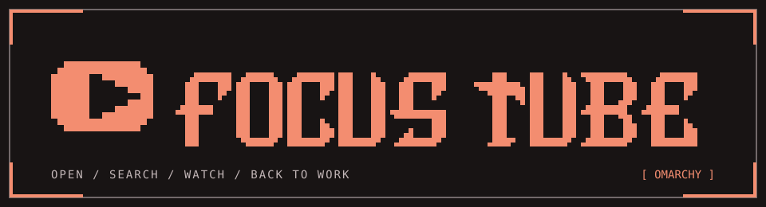
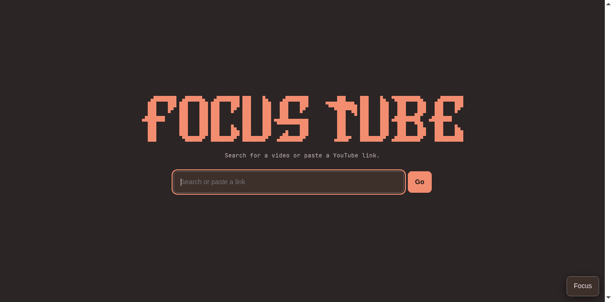
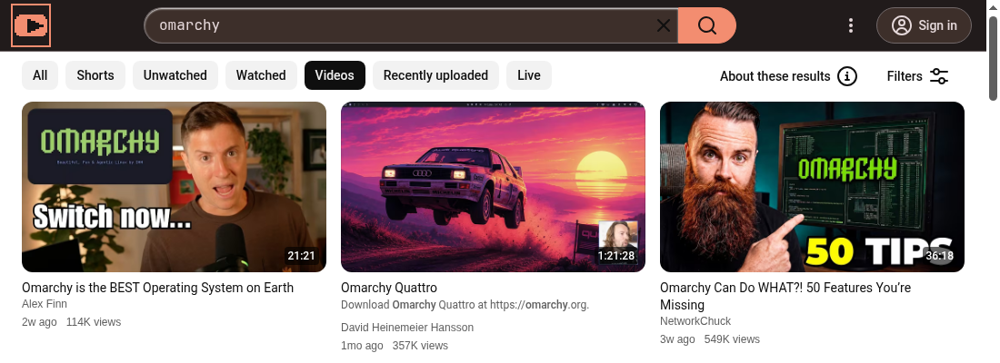

<p align="center">
  
</p>

<p align="center">
  <strong>A quieter YouTube window for <a href="https://omarchy.org/">Omarchy</a>.</strong><br>
  Built to remove clutter and distractions, so you can find a video and get on with your day.
</p>

<p align="center">
  <a href="https://focus-tube-three-zeta.vercel.app/">Website</a> · <a href="#install">Install</a> · <a href="#see-it">See it</a> · <a href="#focus-switches">Focus switches</a> · <a href="#made-for-omarchy">Made for Omarchy</a> · <a href="#contribute">Contribute</a>
</p>

## The idea

Focus Tube was built as a way to remove the clutter and distractions around YouTube videos. It opens YouTube in its own Chromium app window, puts videos and visually distinct channel cards in a compact search grid, and lets you control the parts of the site that pull you away.

This is a work in progress. The ambition is to make Focus Tube feel seamless with Omarchy, from its keyboard shortcut and tiled window to its colors following your theme (as they should! :P).

```text
SUPER + SHIFT + Y  →  SEARCH  →  WATCH  →  BACK TO WORK
```

## See it

**Start with a search.** A simple landing page gives you a place to search or paste a YouTube link.



**Scan the results.** Each card keeps the thumbnail, title, channel, date, and views together. Use the grid icons in the top bar to choose Compact, Large, or Extra large cards; your choice is saved. **Filters** sits beside them, and the extra YouTube search tabs are hidden. The next results begin loading before you reach the end of the grid.



Screenshots use Omarchy's Ristretto palette. Focus Tube follows whichever Omarchy theme you choose.

## Focus switches

Open **Focus** inside the app to choose what appears. These start off:

| Switch | Controls |
| --- | --- |
| Home feed | YouTube's home recommendations |
| Watch suggestions | Recommendations beside a video |
| Shorts | Shorts links and Shorts in results |
| Left menu | YouTube's navigation sidebar |
| End cards | Suggested videos over the ending |
| Autoplay next video | Automatic playback of the next video |

Your choices stay in Focus Tube's dedicated browser profile.

## Made for Omarchy

- **Keyboard first.** Launch it from the app launcher or give it a keybinding.
- **A window that tiles.** Chromium runs as an app window with its own profile, so it fits into your usual layout.
- **One desktop, one palette.** The pixel art, interface colors, and desktop icon use the active Omarchy theme. An open page picks up theme changes on the next YouTube navigation or when the app becomes visible again.
- **Easy to shape.** The interface lives in a small local extension; the focus switches are yours to change at any time.

## Install

### Pacman-managed package

The AUR listing is pending. Publishing `focus-tube-git` and verifying installation through Omarchy's **Install → AUR** menu are tracked in the [roadmap](docs/ROADMAP.md). In the meantime, build the package from the recipe in this repository:

```bash
omarchy pkg add base-devel git
git clone https://github.com/Trolzie/focus-tube.git
cd focus-tube/packaging/aur
makepkg -si
```

Launch **Focus Tube** from the app launcher, or run `focus-tube`. The package installs the app through pacman; the browser profile and generated theme files live in your home directory. First launch sets up the Omarchy theme hook.

### Local install

If you prefer the original install script, with Chromium and Python on your `PATH`:

```bash
git clone https://github.com/Trolzie/focus-tube.git
cd focus-tube
./install.sh
```

Launch it from the app launcher, or run `~/.local/bin/youtube-focus`.

### Shortcut

To launch with **Super+Shift+Y**, add this to your Omarchy `~/.config/hypr/bindings.lua`:

```lua
hl.unbind("SUPER + SHIFT + Y")
o.bind("SUPER + SHIFT + Y", "Focus Tube", "focus-tube")
```

The first line clears Omarchy's existing binding for that key combination. If you used the local install script, replace `"focus-tube"` with `os.getenv("HOME") .. "/.local/bin/youtube-focus"` in the second line.

## Update

For the pacman-managed package, from your `focus-tube` checkout:

```bash
git pull
cd packaging/aur
makepkg -si
```

`git pull` updates the package recipe; `makepkg` fetches the current application source from GitHub. To test an unmerged application change, point the recipe at your branch or a local checkout as described in [CONTRIBUTING.md](CONTRIBUTING.md).

For the local install, from your `focus-tube` checkout:

```bash
git pull
./install.sh
```

Close and reopen Focus Tube to load extension updates. Your browser profile and Focus choices are kept.

## Uninstall

Close Focus Tube before uninstalling. For the pacman-managed package, run:

```bash
focus-tube-uninstall
```

For the local install, run:

```bash
~/.local/bin/focus-tube-uninstall
```

The command removes `focus-tube-git` through pacman if installed, then deletes the local launcher, desktop entry, Omarchy theme hook, generated icon, and `~/.local/share/youtube-focus/`. That directory contains the dedicated Chromium profile, including saved Focus choices, cookies, and browsing data. The command also removes itself. If you added the optional shortcut above, remove those two lines from `~/.config/hypr/bindings.lua`; they are edits you made to your own configuration.

## Contribute

Focus Tube is still taking shape. Bug reports, design ideas, and pull requests are welcome. See [CONTRIBUTING.md](CONTRIBUTING.md) for how to reproduce an issue, test a change, and send a patch.

## Notes

Focus Tube uses YouTube's own pages and can be affected by changes to them. The results grid omits likes and dislikes because YouTube does not expose those counts in search result markup, and [dislike counts are private in its API](https://developers.google.com/youtube/v3/docs/videos). The app and this repository are unofficial and are not affiliated with Omarchy or YouTube.

Focus Tube is available under the [MIT license](LICENSE), the same license used by Omarchy.
